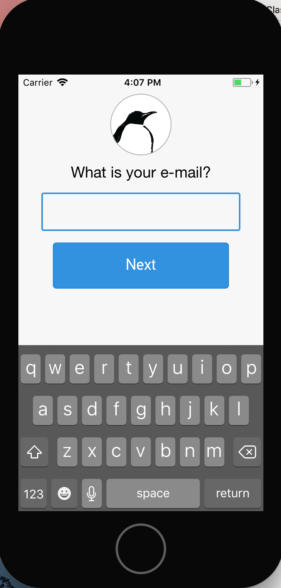

## AXRUITextField

I wanted to create a generic UITextField class for [Hang Local](https://hanglocal.us) that I could use through out the app that I felt was generally much easier to interface with from a UX perspective. 

### Features

1. Includes a UITextField border to more clearly highlight the text field.
2. Ensures the newer darker iOS keyboard is displayed.
3. Enables AutoLayout to programmatically create constraints.

You can see an example of what it looks like here
